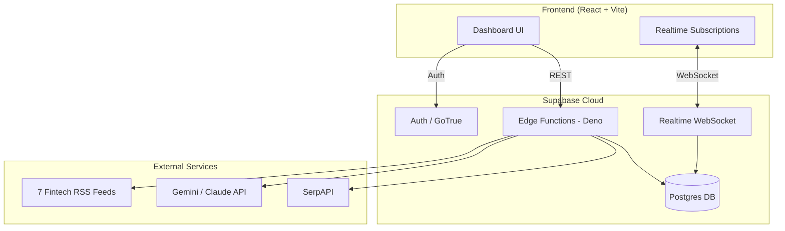

# BlostemPulse

**AI-powered sales intelligence for Indian fintech.**

BlostemPulse is a B2B sales-intelligence dashboard built for Blostem's sales team. It autonomously discovers Indian fintech prospects (NBFCs, neobanks, payments, insurtech, lending) from live RSS feeds, scores their buying intent using AI, generates compliant cold outreach emails, and checks every draft against RBI/SEBI/DPDPA regulations — all in one real-time workspace.

**Why I built this:** Sales teams spend hours manually tracking news, researching companies, and writing outreach emails. BlostemPulse collapses that entire pipeline — discover → score → outreach → comply — into a single AI-driven flow that runs in minutes.

---

## Features

- **Auto-Discovery** — scrapes 7 Indian fintech RSS feeds, extracts company entities with AI, validates via SerpAPI, and inserts them as prospects automatically
- **Intent Scoring** — AI scores each company 0–100 based on recent signals, ICP fit, and regulatory triggers
- **Email Generation** — streams personalized cold emails per stakeholder and tone, token-by-token
- **Compliance Engine** — checks every email against 7 RBI/SEBI/DPDPA rules with one-click AI auto-fix
- **Real-time Dashboard** — live updates via Supabase Realtime; hot/warm/cold prospect tiers, macro alerts, and deep-scan on demand
- **ICP Configuration** — define your ideal customer profile; all scores recalculate automatically
- **Dark / Light Theme** — full design-system support with CSS custom properties

---

## Tech Stack

| Layer | Technology | Role |
|---|---|---|
| Frontend | React 18 + Vite 6 | SPA with client-side routing |
| Routing | React Router 6 | Protected & public routes |
| Styling | Custom CSS design system | Dark/light theming via CSS custom properties |
| Animation | Framer Motion 11 | Page transitions, score deltas, card entrances |
| Icons | lucide-react | Consistent iconography |
| Backend | Supabase (Postgres, Auth, Edge Functions, Realtime) | Database, authentication, serverless functions, live subscriptions |
| AI | Gemini 2.0 Flash (default) or Claude Sonnet | Provider-agnostic — switchable via one env var, zero code changes |
| External APIs | SerpAPI, Clearbit Logo API, Google Favicons | News validation, company logos |
| Deployment | Vercel (frontend) + Supabase Cloud (backend) | SPA rewrite + managed Postgres |

---

## Architecture



**Pipeline flow:**

```
DISCOVER  →  SCORE  →  OUTREACH  →  COMPLY
  RSS + AI      AI        AI          AI
  SerpAPI    ICP fit   Streaming    7 rules
```

---

## Project Structure

```
src/
├── main.jsx                  # React entry point
├── App.jsx                   # Router, providers, route table
├── index.css                 # Full design system (dark + light)
├── lib/supabase.js           # Supabase client init
├── context/
│   ├── AuthContext.jsx       # User/session state, sign in/up/out
│   └── ThemeContext.jsx      # Dark/light theme, persisted
├── components/
│   ├── AppShell.jsx          # Sidebar + layout for /app/* routes
│   └── Toast.jsx             # Toast notification system
├── hooks/
│   └── useRealtimeProspects.js  # Live prospect list via Realtime
├── utils/
│   └── historyStorage.js     # Local history utilities
└── pages/
    ├── LoginPage.jsx         # Auth (email, Google OAuth, password reset)
    ├── OnboardingPage.jsx    # 3-step ICP wizard
    ├── RadarPage.jsx         # Main dashboard — discovery, scoring, scanning
    ├── CompanyDetailPage.jsx # Per-company drill-down with signals & contacts
    ├── OutreachPage.jsx      # Email generation + compliance workspace
    ├── SettingsPage.jsx      # Profile, ICP config, scan schedule
    ├── ResetPasswordPage.jsx # Password reset landing
    └── NotFoundPage.jsx      # 404

supabase/functions/
├── _shared/
│   ├── ai.ts                 # Gemini/Claude adapter (callAI / callAIStream)
│   ├── prompts.ts            # All LLM prompts, centralized
│   └── utils.ts              # CORS headers, JSON parsing
├── discover-prospects/       # Full autonomous discovery pipeline
├── score-intent/             # AI intent scoring (single or rescore all)
├── deep-scan/                # Refresh signals + rescore one company
├── generate-email/           # Streamed outreach email generation
├── check-compliance/         # 7-rule regulatory email checker
├── auto-fix-compliance/      # AI rewrite of flagged sentences only
├── fetch-contact-info/       # AI + SerpAPI contact lookup
├── fetch-signals/            # Alternate discovery pipeline
└── update-cron/              # Scan schedule → pg_cron
```

---

## Installation & Setup

### Prerequisites

- Node.js 18+
- A [Supabase](https://supabase.com) project
- API keys: Gemini (or Anthropic), SerpAPI (optional)

### 1. Clone & install

```bash
git clone https://github.com/your-username/blostempulse.git
cd blostempulse
npm install
```

### 2. Configure environment

Create `.env.local` in the project root:

```env
VITE_SUPABASE_URL=https://your-project.supabase.co
VITE_SUPABASE_ANON_KEY=your-anon-key
```

### 3. Set up Supabase

In your Supabase project:

- **Database**: create tables — `prospects`, `signals`, `macro_events`, `profiles`, `emails_sent`, `scan_logs`
- **Auth**: enable email/password and Google OAuth
- **Realtime**: enable on `prospects` and `signals` tables
- **Edge Functions**: deploy all functions from `supabase/functions/`
- **Secrets**: set the following via `supabase secrets set`:

| Secret | Required? |
|---|---|
| `GEMINI_API_KEY` | Yes (if using Gemini, the default) |
| `ANTHROPIC_API_KEY` | Yes (if `AI_PROVIDER=claude`) |
| `AI_PROVIDER` | Optional — `gemini` (default) or `claude` |
| `SERPAPI_KEY` | Optional — functions degrade gracefully without it |

### 4. Run locally

```bash
npm run dev
```

Open `http://localhost:5173` in your browser.

---

## Usage

1. **Sign up / Log in** — email + password or Google OAuth
2. **Radar Dashboard** — click **"Discover Now"** to kick off AI-powered prospect discovery from live RSS feeds
3. **Review prospects** — companies are auto-scored and sorted into Hot / Warm / Cold tiers
4. **Deep Scan** — click scan on any company to pull fresh signals and rescore in real-time
5. **Company Detail** — drill into any prospect to see signal breakdown, AI analysis, and contact info
6. **Generate Outreach** — pick a stakeholder + tone, get a streamed AI email draft
7. **Compliance Check** — every email is auto-checked against 7 regulatory rules; one-click auto-fix for violations
8. **Send** — copy to clipboard or open directly in Gmail; mark as contacted to auto-advance

---

## Screenshots / Demo

> **Live Demo**: *[Add your deployed URL here]*

The app features a dark-themed glassmorphic UI with real-time updates, animated score rings, signal dot indicators, and a responsive sidebar navigation.

---

## API Documentation

All endpoints are Supabase Edge Functions accessed via `POST /functions/v1/<function-name>`. Requests require an `Authorization: Bearer <access_token>` header.

| Endpoint | Body | Response |
|---|---|---|
| `discover-prospects` | `{}` | `{ discovered, companies[], headlines_processed }` |
| `score-intent` | `{ company_id }` or `{ rescore_all: true }` | `{ results: [{ company_id, name, score, reason }] }` |
| `deep-scan` | `{ company_id, company_name }` | `{ new_score, delta, new_signals[] }` |
| `generate-email` | `{ company_id, stakeholder, tone }` | SSE stream (subject line 1, then body) |
| `check-compliance` | `{ email_body }` | `{ passed, flags[] }` |
| `auto-fix-compliance` | `{ email_body, flags[] }` | `{ fixed_email_body }` |
| `fetch-contact-info` | `{ company_name }` | `{ website, linkedin, email, cto, cfo, ... }` |
| `update-cron` | `{ frequency: '2x' \| '4x' \| 'manual' }` | `{ success, schedule }` |

---

## Engineering Decisions

- **Provider-agnostic AI adapter** — `_shared/ai.ts` normalizes Gemini and Claude behind a single interface. Gemini's streaming SSE is transformed to match Claude's shape so the frontend never needs to know which model is active. Switching providers is a single env var change.
- **Client-side fallbacks everywhere** — every AI/network feature has a local fallback (template emails, regex compliance, random score jitter) so the demo never visibly breaks, even with no API keys.
- **Realtime-first architecture** — three independent Supabase Realtime channels (prospects, signals, scan-logs) ensure the dashboard updates live whether triggered by the user, a cron job, or another session.
- **Centralized prompt library** — all LLM prompts live in `_shared/prompts.ts`, making it easy to tune behavior without touching function logic.
- **CSS custom-property design system** — no CSS framework dependency for the actual styling; the entire theme is driven by CSS variables with `[data-theme]` overrides.

---

## Testing

- **Manual testing** via the live dashboard — the `DEMO_SCRIPT.txt` in the repo root provides a step-by-step walkthrough of all major flows
- **Demo Controls** in Settings page — "Load Demo Signals" seeds realistic test data; "Clear Signals" and "Reset Scores" allow quick resets
- **Edge Functions** can be tested individually via `curl` or the Supabase dashboard's function invocation UI

---

## Limitations & Future Improvements

**Current limitations:**
- Onboarding flow exists but is not enforced in the routing — users skip directly to the dashboard
- No automated test suite (unit/integration)
- Database schema and RLS policies are managed via manual SQL, not version-controlled migrations
- `pg_cron` schedule setup requires a manual Postgres RPC that isn't in this repo

**Future improvements:**
- Add a DB-level uniqueness constraint on prospect names to replace client-side dedup
- Consolidate the 4 separate logo-fallback implementations into one shared component
- Add Supabase migrations for reproducible schema setup
- Build an automated test suite
- Add email delivery integration (currently copies to clipboard / opens Gmail)
- Support additional geographies beyond India

---

*Built for a hackathon. Optimized for live demos and real-world sales intelligence.*
